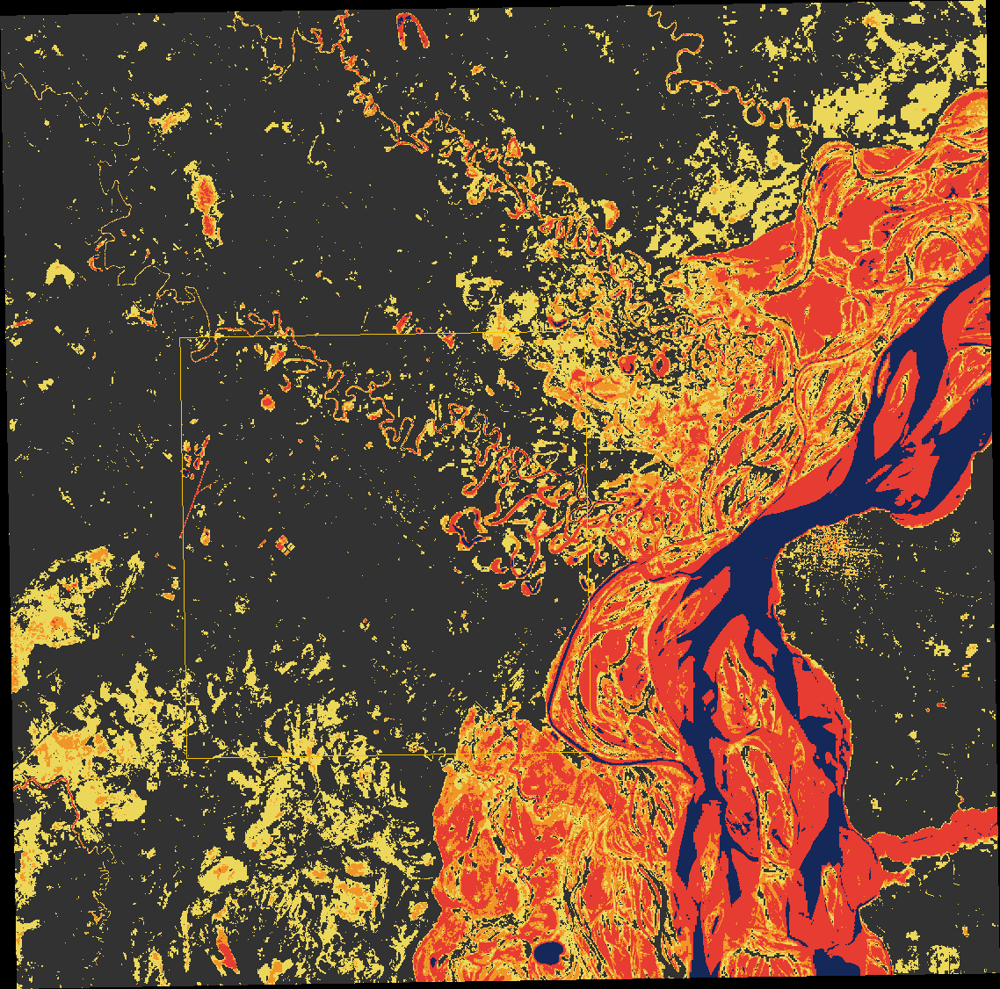
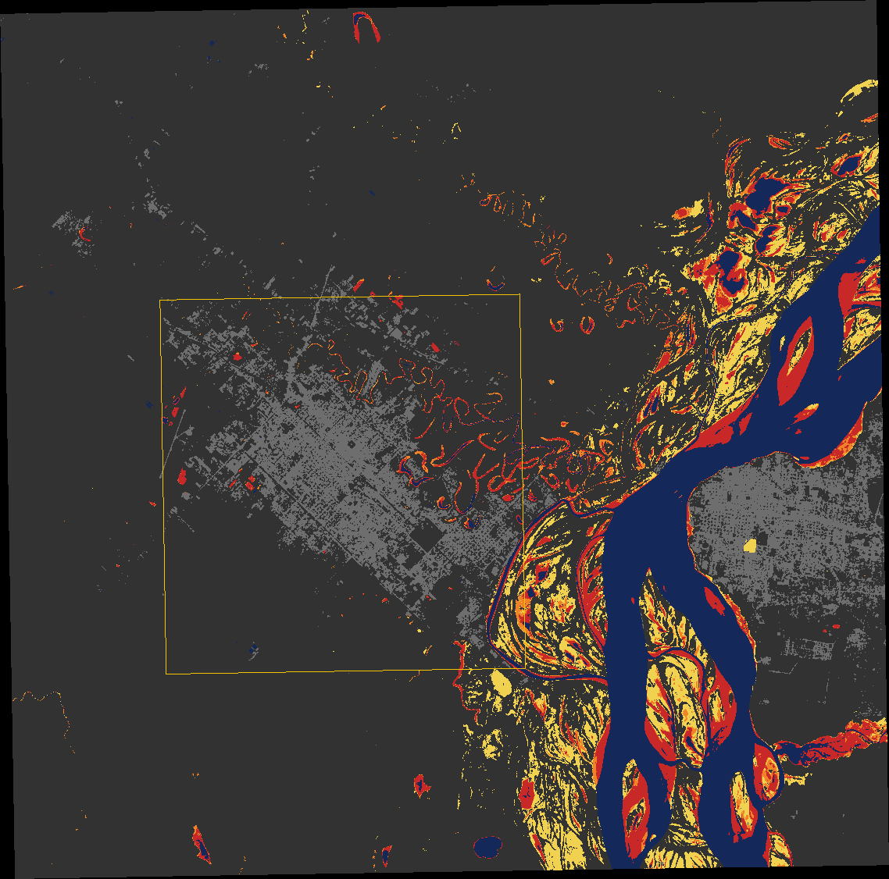
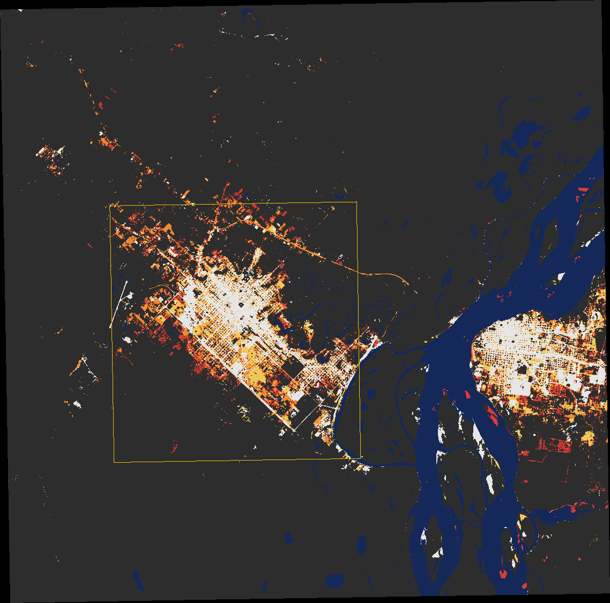

# Áreas inundables del Gran Resistencia

Investigación del 06/10/2026. Tres preguntas: qué imágenes antiguas existen,
qué zonas quedaron bajo agua en cada inundación, y cómo se relaciona cada una
con la altura del río y con el clima de ese momento.

**No es una zonificación de riesgo.** La zonificación oficial existe y es de la
APA (ver «Lo que ya está demarcado»). Lo de acá es observación: dónde hubo agua
en las fechas en que pasó un satélite.

## Resumen

- **Fotografías aéreas antiguas existen, pero ninguna se puede bajar.** Están
  en archivos que hay que pedir. Lo que sí está abierto son las imágenes
  Landsat, **desde el 30/08/1972**: 170 escenas del área hasta 1984, entre
  ellas una del **20/06/1983, dos días antes del máximo del registro**.
- **Se demarcó el agua en 23 de esas imágenes**, de 1981 a 2023. Con el río en
  8,53 m (junio de 1983) el agua cubría 522 km² de un recuadro de 1.117 km²;
  con el río en 2,44 m (1981), 112 km².
- **Después se procesó toda la serie: 337 escenas desde 1984.** De ahí sale
  un mapa de a qué altura del río se moja cada lugar, hasta 7 m. Coincide 0,97
  con el producto independiente del JRC.
- **La superficie construida se duplicó en 35 años** (20 a 41 km²), y de lo
  construido hoy casi nada se moja con el río hasta 7 m.
- **Hay dos inundaciones distintas y caen en lugares distintos.** La del río
  ocupa el valle del Paraná y el bajo río Negro, al norte, este y sur de la
  ciudad. La de lluvia (enero de 2019, con el río en 4,43 m) se junta al oeste
  y sudoeste.
- **La altura del río explica la mancha, pero no en línea recta.** Hasta unos
  7 m el agua se mueve entre 190 y 270 km²; por encima de 8 m salta.
- **El Niño fuerte casi garantiza crecida**: en 7 de los 8 episodios de Niño
  fuerte desde 1950 el río pasó los 6,50 m. Pero la quinta y la sexta crecida del
  registro (1989/90 y 1996/97) llegaron sin Niño.
- **La mayor crecida llegó con tiempo seco acá.** En el mes previo al pico de
  1983 llovió menos de lo normal en Resistencia. En 1998 fue al revés: río en
  7,8 m y el mes más lluvioso de la serie modelada, a la vez.
- **ERA5 no sirve para las tormentas de Resistencia**: dio la mitad de lo
  medido en los tres meses que se pudieron controlar.

## Qué imágenes antiguas existen

| Fuente | Desde | Detalle | ¿Se puede bajar? |
|---|---|---|---|
| **Landsat MSS** | 30/08/1972 | 60 m, cuatro bandas | Sí, sin cuenta |
| **Landsat TM / ETM+ / OLI** | 11/04/1984 | 30 m | Sí, sin cuenta |
| Esri Wayback | 2014 | submétrico | Sí; ya está en el panel |
| Fotografía aérea 1:75.000 | sin fecha | la usó la UNNE para fotointerpretar Resistencia | No: está en papel |
| Fotos de las inundaciones de 1929, 1966, 1982, 1983 y 1998 | — | las reproduce la APA en una presentación de 2021 | No: son ilustraciones, sin georreferencia |
| Archivo de fotogramas del IGN | — | vuelos analógicos históricos | No encontré catálogo en línea; hay que pedirlo |
| Satélites espía desclasificados (CORONA, KH-9), USGS | 1960–1980 | 2 a 8 m | Sin verificar: EarthExplorer pide cuenta |

- **Landsat se lee desde Microsoft Planetary Computer**, sin cuenta ni clave:
  el catálogo STAC es abierto y el permiso de lectura se pide anónimo. Son
  GeoTIFF que se leen por ventanas, sin bajar la escena entera.
- **1982 y 1983 están muy bien cubiertos**: una escena cada 7 a 16 días. De la
  crecida de 1966 no hay nada: es anterior al primer Landsat.
- **De 1992 y 1998 hay pocas imágenes limpias.** El pico de junio de 1992 no
  tiene ninguna; la más cercana es del 19/05, con el río en 6,93 m y subiendo.
  La de 1998 es del 20/05, dieciséis días después del pico, con nubes.
- **La órbita 227/079 sirve a veces, y eso se había leído mal.** Cubre el
  oeste del área, y cuánto cambia de una pasada a otra: con el Landsat 5 son
  tres cuartos del recuadro urbano o menos, pero el 07/03/1983 entra la ciudad
  entera. Las escenas que cubren todo el recuadro son las 226/079 (y 243/079
  en los Landsat 1 a 3). Ver «Tercera pasada».
- Dónde pedir fotografía aérea: IGN (fotogramas históricos), APA (las que usó
  para la línea de ribera de 1993 y el estudio Halcrow), el Instituto de
  Investigaciones Geohistóricas de la UNNE y Catastro municipal.

## Dónde hubo agua

`admin/scripts/inundaciones/landsat-eventos.mjs` clasifica el agua en cada
escena sobre un recuadro de 1.117 km² (59,12° a 58,78° O, 27,60° a 27,30° S) y
sobre un recuadro urbano de 199 km² que contiene a Fontana, Resistencia,
Barranqueras y Vilelas.

**Dos criterios, y no dicen lo mismo:**

| | Cómo | Dónde se puede | Qué incluye |
|---|---|---|---|
| **Infrarrojo cercano** | por debajo del umbral de Otsu de la escena | toda la serie | agua, suelo saturado, vegetación inundada rala, **sombras** |
| **Agua abierta** (MNDWI > 0) | verde contra infrarrojo medio | desde 1984 | sólo espejo de agua |

El primero es el único posible en las imágenes de los 80 y por eso es el común
a toda la serie. En las imágenes modernas se calcularon los dos: coinciden
entre el 42 y el 76 % (intersección sobre unión). **La superficie depende del
criterio tanto como de la crecida**, y hay que decir con cuál se midió.

### Las escenas

Altura de Barranqueras de ese día, de `public/rio/barranqueras_diario.json`.
Superficies en km². «Urbano» es el recuadro de 199 km².

| Fecha | Río (m) | Agua, infrarrojo | Urbano | Agua abierta | Urbano | Nota |
|---|---|---|---|---|---|---|
| 10/08/1981 | 2,44 | 112 | 7,2 | — | — | aguas bajas |
| 09/07/1982 | 6,30 | 201 | 13,5 | — | — | |
| 14/08/1982 | 5,15 | 207 | 16,5 | — | — | tres semanas después de la rotura del dique |
| 28/02/1983 | 7,80 | 283 | 21,4 | — | — | |
| 07/03/1983 | 8,02 | 95 | 24,7 | — | — | órbita 227: ve el 64 % del recuadro, y el urbano entero |
| **20/06/1983** | **8,53** | **522** | **52,6** | — | — | dos días antes del máximo |
| 22/07/1983 | 8,26 | 373 | 33,1 | — | — | la más limpia de la crecida |
| 23/08/1983 | 5,98 | 270 | 19,1 | — | — | |
| 08/09/1983 | 5,04 | 242 | 17,7 | — | — | |
| 07/08/1986 | 3,30 | 159 | 14,4 | 123 | 9,3 | aguas bajas |
| 22/05/1987 | 5,87 | 191 | 18,9 | 148 | 10,8 | |
| 23/02/1990 | 3,48 | 282 | 21,7 | 128 | 6,3 | tres semanas después del pico de 7,66 m |
| 19/05/1992 | 6,93 | 205 | 18,8 | 125 | 9,7 | 23 % tapado por nubes |
| 09/04/1998 | 7,22 | — | — | 6 | 2,5 | órbita 227: ve el 49 % del recuadro, sin el Paraná; el infrarrojo no vale (ver «Tercera pasada») |
| 20/05/1998 | 7,07 | 243 | 35,3 | 104 | 6,5 | 26 % tapado por nubes |
| 21/06/1998 | 4,77 | 194 | 15,7 | 136 | 7,9 | |
| 27/10/1998 | 6,71 | 233 | 14,0 | 167 | 8,2 | |
| 29/01/2010 | 6,72 | 267 | 13,3 | 187 | 5,6 | |
| 19/07/2014 | 5,09 | 164 | 6,7 | 102 | 2,3 | |
| 14/01/2016 | 7,23 | 263 | 14,5 | 140 | 3,3 | |
| 22/01/2019 | 4,43 | 233 | 12,6 | 101 | 1,7 | **lluvia**, no río; nubes sobre la ciudad |
| 07/08/2021 | 0,34 | 79 | 2,7 | 61 | 1,0 | bajante extraordinaria |
| 25/11/2023 | 6,07 | 236 | 11,7 | 128 | 2,1 | |

Dos escenas se procesaron y se descartaron: el 11/01/1983 y el 04/06/1983
cuentan sombras de nube como agua (manchas grandes y lisas pegadas a las nubes,
que no están en la escena siguiente).

### Lo que se ve

- **Junio de 1983: casi la mitad del recuadro bajo agua.** 522 km² contra 112
  en aguas bajas. El valle del Paraná, el bajo río Negro y todo el norte y el
  este de la ciudad son un solo espejo. La parte firme es ésa; las manchas
  sueltas al oeste de la ciudad en esa escena no se pudieron confirmar y no
  están el 22/07.
- **Julio de 1983, la imagen más limpia: 373 km², y 33 km² del recuadro
  urbano.** El casco queda seco adentro de las defensas provisorias; el agua
  rodea a la ciudad por el norte, el este y el sur.
- **Agosto de 1982: el valle del río Negro inundado dentro de la ciudad, con
  el Paraná en 5,15 m.** Es lo que quedó de la rotura del dique regulador de
  julio. El agua adentro del recuadro urbano más que duplica la de 1981 (16,5
  contra 7,2 km²) con el río un metro por debajo del alerta: **esa inundación
  no la explica la altura de ese día.**
- **Enero de 2019: el agua está del otro lado.** Con el río en 4,43 m el
  Paraná está en su cauce, y lo anegado es el oeste y el sudoeste. Por
  infrarrojo son 233 km², lo mismo que una crecida de 6,7 m, en otro lugar.
- **El agua abierta adentro del recuadro urbano fue bajando**: 9 a 11 km²
  entre 1986 y 1992, 5,6 en 2010 y 2 a 3 desde 2014, con el río a la misma
  altura o más alto. Coincide con el cierre del anillo de defensas y con el
  relleno de lagunas, y no se pueden separar desde acá. En la bajante de 2021
  queda 1 km².

### El compuesto

En cuántas de las 17 escenas de crecida hubo agua en cada lugar. Azul oscuro,
agua permanente (agua en las tres escenas de aguas bajas, 46 km²). Rojo, 10 o
más; naranja, 6 a 9; amarillo, 3 a 5. El recuadro amarillo es el urbano.

| Bajo agua en… | Recuadro | Urbano |
|---|---|---|
| 3 o más de 17 | 389 km² | 37 km² |
| 6 o más | 238 km² | 16 km² |
| 10 o más | 149 km² | 7 km² |

- **Una o dos veces no se pinta.** Ahí caen los artefactos de una escena sola.
- **No es una recurrencia.** Las 17 escenas son las que hay, no una muestra:
  siete son de 1982 y 1983. «10 de 17» quiere decir que se moja con casi
  cualquier crecida, no «una vez cada 1,7 años».
- En el recuadro urbano lo que más se repite son las lagunas y meandros del
  río Negro y el borde este.

### Archivos

`docs/geo/inundaciones/`:

- `manchas-landsat.geojson` (7,6 MB): el agua permanente, las tres clases de
  frecuencia y la mancha de ocho fechas (14/08/1982, 28/02, 07/03, 20/06 y
  22/07/1983, 20/05/1998, 14/01/2016 y la de lluvia del 22/01/2019). WGS84.
  **El compuesto va en grilla de 90 m y sin las manchas de menos de 8 ha; la
  mancha de cada fecha, a 60 m y desde 1,5 ha** (hasta el 07/10/2026 iban
  también a 90 m, y se perdían los bajos chicos del área urbana). Las fechas
  que no ven todo el recuadro llevan además el polígono de lo que no ven
  (`capa: 'sin imagen'`).
- `canal-16.geojson`: la traza del Canal 16, de OpenStreetMap.
- `landsat-escenas.json` y `landsat-resultado.json`: lo que entra y lo que sale.
- `mascaras/`: una imagen por escena, para mirar antes de creer el número.

### Lo que este método no ve

- **Agua debajo de monte o camalotal cerrado.** Las islas del Paraná tienen
  selva en galería: a 7 m están inundadas y el índice de agua abierta casi no
  se mueve. La mancha es un piso.
- **Agua debajo de nubes**, que en una crecida de verano son la regla.
- **Sombras.** MSS no las detecta. Por eso cada escena se miró antes de
  usarla, y dos se descartaron.
- **El pico.** Hay una imagen cada 16 días y pocas sin nubes. Ninguna es del
  día del máximo; la del 20/06/1983 es la más cercana.
- **El umbral es propio de cada escena**: dos fechas no se comparan al km².
- **MSS tiene 60 m y está georreferenciada con menos precisión** (nivel T2).
  Sirve para la mancha, no para decir si una manzana se mojó.
- **El recuadro urbano es un rectángulo**, no el recinto defendido. Desde el
  08/10/2026 está la traza de la defensa del Área Metropolitana
  (`defensa-amgr.kml`, 31,5 km), y con la RN 11 como cierre oeste y una
  recta supuesta de 7,9 km al sur arma el recinto (`recinto-amgr.geojson`,
  113 km²). La pantalla no dibuja el agua del río adentro mientras el río no
  pase el coronamiento.

## Segunda pasada: toda la serie, Sentinel-2 y el control externo

Lo de arriba son 21 escenas elegidas a mano. Esto es lo que se pudo sumar sin
pedirle nada a nadie. Scripts en `admin/scripts/inundaciones/`.

### Toda la serie Landsat desde 1984

**337 escenas** de 1984 a 2026 (las que tienen 10 % de nubes o menos, más las
de fechas con el río sobre 6,30 m aunque estén nubladas). Agua abierta (MNDWI),
no infrarrojo: es el criterio conservador.

- **Se descartaron 11 escenas imposibles**: más de 600 km² de agua —más que en
  1983— o menos de 45 con la escena entera a la vista, cuando en la bajante de
  2021 hay 61. Son productos fallados. Otras 30 no bajaron por errores de red.
- **Tres escenas con mucha agua y el río bajo quedaron sin explicar**: 364 km²
  el 04/10/2007 con el río en 2,36 m, 328 el 27/09/1987 y 316 el 15/07/2001.
  Son de fin de invierno, época de quemas en el valle, y un quemado reciente
  puede dar el mismo índice que el agua. No se miraron una por una; no entran
  en el mapa de abajo porque el río venía bajando.

**La superficie de agua contra la altura del río:**

| Río en Barranqueras | Escenas | Agua abierta, mediana | Mínimo y máximo |
|---|---|---|---|
| menos de 4 m | 54 | 89 km² | 56 a 173 |
| 4 a 5 m | 22 | 114 km² | 86 a 161 |
| 5 a 6 m | 12 | 129 km² | 105 a 166 |
| 6 a 7 m | 7 | 155 km² | 118 a 221 |
| 7 m o más | 1 | 140 km² | el 14/01/2016 |

- Sólo escenas con el 85 % del recuadro a la vista y **con el río sin bajar**:
  a menos de 30 cm de su máximo de los 30 días anteriores. Con esas la
  correlación de rangos es **0,89** (96 escenas); con todas, 0,79 (313). Es la
  medida de cuánto pesa el agua que queda después del pico.
- **Sobre 7 m hay una sola escena limpia en 40 años.** Las crecidas llegan con
  nubes. Por eso el mapa de abajo llega hasta 7 m y no más: lo que pasa por
  encima sale de las imágenes de 1983, que son otro sensor y otro criterio.

### A qué altura del río se moja cada lugar

Para cada lugar, la clase de altura más baja en la que hubo agua abierta en la
mitad o más de las escenas (con tres como mínimo). Azul oscuro, con menos de
4 m; rojo, de 4 a 5; naranja, de 5 a 6; amarillo, de 6 a 7. En gris claro, lo
construido hoy.

| Se moja con el río en… | Recuadro | Recuadro urbano |
|---|---|---|
| menos de 4 m | 84 km² | 1,6 km² |
| 4 a 5 m | 34 km² más | 3,2 |
| 5 a 6 m | 14 km² más | 1,7 |
| 6 a 7 m | 39 km² más | 1,2 |

- **Es el producto más útil de la investigación**: contesta por lugar y no por
  fecha, y se apoya en decenas de escenas por clase, no en una.
- **De lo construido hoy, casi nada se moja con el río hasta 7 m**: 0,04 km²
  de 41. El agua abierta llega al borde de la ciudad y no entra. Es coherente
  con las defensas, pero no las prueba: tampoco ve agua en la calle.
- **El amarillo es el valle del Paraná frente a Barranqueras y Vilelas**, que
  recién se cubre sobre los 6 m.
- No dice nada de la lluvia: una laguna que se llena con una tormenta y el río
  bajo no aparece en ninguna clase.

### El control contra el JRC

El *Global Surface Water* del JRC da, para cada píxel, en qué porcentaje de las
observaciones de 1984 a 2021 hubo agua. Usa las mismas imágenes Landsat con un
clasificador propio y sin ninguna de las decisiones de acá.

| | Propio | JRC | Coinciden |
|---|---|---|---|
| Correlación píxel a píxel | | | **0,97** |
| Agua en el 10 % o más de las veces | 149 km² | 124 km² | 0,79 |
| En el 50 % o más | 97 km² | 89 km² | 0,86 |
| En el 90 % o más | 55 km² | 59 km² | 0,83 |

- **El método propio no inventa agua ni la pierde** donde hay con qué comparar.
- Da algo más de agua ocasional (10 % o más). Las tres escenas sin explicar y
  la segunda pasada, que suma a propósito fechas de crecida, empujan para ese
  lado.
- **No controla las manchas de 1982–83**, que son anteriores al JRC y de otro
  sensor.

### Sentinel-2: los eventos recientes a 10 m

| Fecha | Qué | Río (m) | Agua abierta | Urbano |
|---|---|---|---|---|
| 19/08/2021 | bajante | 0,38 | 62 km² | 1,6 |
| 27/01/2018 | crecida, un día después del pico | 6,53 | 137 km² | 3,5 |
| 17/01/2019 | lluvia | 4,08 | 103 km² | 3,8 |
| 22/01/2019 | lluvia | 4,43 | 95 km² | 2,0 |
| 06/02/2019 | lluvia | 3,16 | 92 km² | 2,6 |
| 07/11/2023 | crecida, subiendo | 6,76 | 183 km² | 5,0 |
| **12/11/2023** | **crecida, dos días después del pico** | **6,94** | **205 km²** | **6,5** |

- **El 12/11/2023 es la mejor imagen moderna de una crecida**: sin nubes, a 10
  m y a dos días del pico de 7,05 m. El borde oeste de la mancha es una línea
  neta que sigue a Barranqueras y Vilelas: es la defensa.
- **Coincide con Landsat donde se pueden comparar.** El 22/01/2019 pasaron los
  dos el mismo día: 95 km² Sentinel-2 y 101 Landsat. En la bajante de 2021, 62
  y 61.
- **La lluvia de enero de 2019 casi no deja agua abierta.** El 17/01, cinco
  días después de lo peor, hay 3,8 km² en el recuadro urbano contra 1,6 en la
  bajante, y una mancha grande en el sudoeste del recuadro. El anegamiento de
  calles no se ve: a los cinco días ya escurrió, y a 10 m no entra una calle.
  **Lo que la primera pasada mostraba como 233 km² por infrarrojo era sobre
  todo suelo saturado, no espejo de agua.**
- El 12/02/2016 no se pudo bajar. Antes de 2016 no hay Sentinel-2.

`manchas-sentinel2.geojson` (4,8 MB) tiene el agua permanente y la mancha de
cada fecha.

### La mancha urbana por época

Blanco, construido en 1984–89; amarillo, sumado a 1998–2002; naranja, a
2009–13; rojo, a 2020–25. Construido = poca vegetación (NDVI menor a 0,4) en
el 80 % o más de las escenas de la época, y que no sea agua. Lo que sólo está
pelado una temporada no llega.

| Época | Escenas | Recuadro urbano |
|---|---|---|
| 1984–1989 | 42 | 20,1 km² |
| 1998–2002 | 53 | 25,7 km² |
| 2009–2013 | 25 | 39,0 km² |
| 2020–2025 | 89 | 40,9 km² |

- **La superficie construida se duplicó en 35 años**, y el salto grande es
  entre 2000 y 2010.
- **Es una clasificación propia y aproximada.** Un barrio muy arbolado no
  entra, así que el número es un piso; y cuenta también una pista o una playa
  de maniobras. En el recuadro grande entran además la ciudad de Corrientes y
  los bancos de arena: por eso las cifras son las del recuadro urbano.
- **Cuánto de lo que estuvo bajo agua en 1982–83 hoy está construido** (dentro
  del recuadro urbano):

| Imagen | Sobre lo construido hoy | De eso, construido después de 1989 |
|---|---|---|
| 14/08/1982, dique roto | 2,3 km² | 0,9 km² |
| 22/07/1983, la más limpia | 1,7 km² | 1,4 km² |
| 20/06/1983, sin confirmar al oeste | 7,2 km² | 5,0 km² |

  **La mayor parte de lo construido sobre el agua de 1983 se hizo después.**
  Es poco contra 41 km², pero es justo donde la ciudad creció hacia lo que se
  inundó. La cifra firme es la de julio; la de junio hereda la duda de esa
  escena.

`zonas-serie.geojson` (1,5 MB) tiene las cuatro zonas por altura, acumuladas,
y la mancha urbana de las cuatro épocas. `serie-resultado.json`, la fila de
cada escena.

## Tercera pasada: la otra órbita, el Canal 16 y los modelos de elevación

Del 07/10/2026. La pestaña tenía un error: **con
el pico de 1998 (8,17 m) el agua entró al Canal 16**, el último canal al sur
del Gran Resistencia. La pantalla mostraba el canal seco a esa altura.

### Por qué mostraba eso

- A 8,17 m el panel dibujaba la mancha del 28/02/1983 (7,80 m), que es la más
  alta que no supera lo pedido, y esa mancha casi no toca el canal.
- **Del pico de 1998 no hay imagen.** La órbita 226/079 pasó el 18/04 (77 % de
  nubes; del recuadro se ve el 2 %) y el 20/05; del 04/05, el día del pico, no
  hay escena en el catálogo.
- El canal son 9,4 km, de 27,457° S 59,052° O a 27,520° S 58,987° O, entero
  adentro del recuadro urbano.

### Lo que se encontró: escenas de la otra órbita

La serie y las manchas se armaron sólo con la órbita 226/079. Listando **todas**
las escenas de cualquier órbita con el río en 7,20 m o más salen 29, y entre
las de la 227/079 hay varias sin nubes que nunca se habían mirado:

| Fecha | Río (m) | Sensor | Qué ve del recuadro urbano | Sirve |
|---|---|---|---|---|
| 19/02/1983 | 7,33 | MSS | 44 % | parcial |
| **07/03/1983** | **8,02** | MSS | **100 %** | **sí: es la capa nueva** |
| 23/03/1983 | 7,55 | MSS | 47 % | parcial |
| 19/05/1983 | 8,11 | MSS, órbita 226 | 54 % con nubes | no se usó |
| 11/06/1983 | 7,92 | MSS | 12 % | no |
| 27/06/1983 | 8,45 | MSS | 1 % | no |
| 06/07/1983 | 7,95 | MSS, órbita 226 | nubes que la máscara no marca | no: descartada al mirarla |
| 29/07/1983 | 7,53 | MSS | 36 % | parcial |
| 29/05/1987 | 7,28 | TM | 5 % | no |
| 19/06/1992 | 7,47 | MSS | 2 % | no |
| 17/02/1997 | 7,28 | TM | 30 % | parcial |
| 09/04/1998 | 7,22 | TM | 74 % | sí, como control |
| 21/01/2016 | 7,22 | OLI | 72 % | parcial |

- **La del 07/03/1983 es la imagen que faltaba**: río en 8,02 m —15 cm por
  debajo del pico de 1998—, sin nubes, con la ciudad entera. No ve el valle
  del Paraná al este (el 36 % del recuadro).
- **La huella de la órbita 227 cambia mucho de una pasada a otra**, sobre todo
  con el Landsat 4: por eso ayer se la descartó mirando escenas del Landsat 5.
- **Una escena de la 227 hay que mirarla antes de usarla.** La del 27/05/1998
  figura cubriendo todo el recuadro y muestra otro lugar: está mal
  georreferenciada, y eso no se nota en ningún número.
- **El infrarrojo con umbral de Otsu no vale en una escena sin el Paraná.**
  Otsu busca dos poblaciones; sin un cuerpo de agua grande parte la tierra en
  dos. El 09/04/1998 da 207 km² de «agua» sobre 550 km² vistos, contra 6 km²
  de agua abierta. La del 07/03/1983 sí tiene el desborde del Paraná adentro,
  y su mancha se revisó a la vista. En las escenas parciales de TM vale sólo
  el agua abierta.
- El pico de junio de 1992 (8,25 m) sigue sin imagen útil: la del 19/06 ve el
  2 % del recuadro urbano.

### Qué dicen las imágenes sobre el Canal 16

Parte del canal con agua de cada mancha a menos de 155 y de 310 m, en seis
tramos de 1,6 km, de noroeste a sudeste:

| Imagen | Río (m) | A menos de 155 m | A menos de 310 m |
|---|---|---|---|
| 12/11/2023 | 6,94 | 0 en los seis | — |
| 14/01/2016 | 7,23 | 0 en los seis | 0 · 0 · 0 · 0 · 0 · 13 % |
| 28/02/1983 | 7,80 | 69 · 0 · 0 · 0 · 0 · 3 % | 100 · 0 · 0 · 0 · 0 · 26 % |
| 07/03/1983 | 8,02 | 67 · 0 · 0 · 0 · 5 · 26 % | 92 · 0 · 0 · 0 · 8 · 59 % |
| 22/07/1983 | 8,26 | 0 en los seis | 0 · 0 · 0 · 0 · 0 · 23 % |
| 20/06/1983 | 8,53 | 67 · 28 · 67 · 82 · 46 · 95 % | 79 · 59 · 100 · 95 · 87 · 100 % |

- **Hasta 7,23 m no hay agua junto al canal** en ninguna imagen, y en las dos
  de 1998 (7,22 y 7,07 m) no se ve agua abierta sobre él.
- **Entre 7,80 y 8,02 m aparece agua junto al tramo final**, el que da al
  Paraná: de 26 a 59 % a menos de 310 m, en una semana y con el río 22 cm más
  alto. A la vista son manchas de 5 a 10 ha encadenadas hacia el desborde del
  Paraná.
- **El primer tramo no cuenta**: lo que tiene al lado en febrero y marzo de
  1983 son las piletas de la cabecera del canal, que están en todas las
  imágenes.
- **El 22/07/1983, con 8,26 m, hay menos que el 07/03 con 8,02.** No es
  monótono, y no se sabe por qué: otra época del año, otro umbral, o agua bajo
  vegetación. Es el límite de leer esto a 60 m.
- **El 20/06/1983 hay agua a lo largo de casi todo el canal.** Son las «manchas
  sueltas al oeste» que quedaron sin confirmar porque no están el 22/07. Lo
  que se sabe de 1998 las hace más creíbles, y no las confirma.
- **Ninguna imagen muestra el canal desbordado**: un canal no se ve a 60 m.
  Lo que hay es compatible con que el agua le entre por abajo cerca de los 8
  m, y no prueba más que eso.

**En el panel va como lo que es**: la capa del 07/03/1983 es agua vista, y lo
que se sabe del pico de 1998 va aparte, como texto («Informado, sin
imagen»), al llegar a 8,17 m. No se pinta como agua.

### Los modelos de elevación de 30 m no alcanzan

Se probó si el terreno podía decir lo que la imagen no: se llevaron a la
grilla de las manchas el MDE-Ar v2.1 del IGN (30 m, descarga libre) y el
Copernicus GLO-30, y se los enfrentó al agua observada y al canal.

| | IGN MDE-Ar | Copernicus GLO-30 |
|---|---|---|
| Cota del terreno sobre el Canal 16, mediana | 51,9 m | 49,9 m |
| ídem, del 10 al 90 % | 51,1 a 52,6 | 49,2 a 51,0 |
| Canal por debajo de la cota del río de 1998 (49,4 m IGN) | 0 % | 18 % |
| «Terreno bajo la cota» contra el agua vista, mejor coincidencia | 0,35 a 0,40 | 0,59 a 0,66 |

- **Difieren entre sí 1,8 m de media y 2,2 m de dispersión** en el recuadro
  urbano. Entre una crecida de 7 m y la de 1998 hay 1,2 m.
- **Uno dice que el canal queda 2,5 m arriba del agua de 1998 y el otro, medio
  metro.** Ninguno de los dos sirve para decidir.
- La coincidencia es la de las tres escenas de 1998 que ven todo el recuadro
  (intersección sobre unión, con el nivel que mejor separa agua de tierra).
  Ese nivel sube menos que el río: en Copernicus, 1 m entre una escena con
  4,77 m y otra con 6,63.
- **Por eso no se dibuja ninguna «zona bajo cota».** Sería una mancha calculada
  con un error mayor que lo que se quiere distinguir.
- Lo que sí cambiaría esto es el **MDT de 5 m del IGN** sobre
  Corrientes–Resistencia (vuelo de 2016) y el de 0,5 m de Fontana (2021). No
  se descargan: se piden a asesoriatecnica@ign.gob.ar. El borrador del pedido
  está en `docs/pedido-ign-mde-gran-resistencia.txt`.

Scripts, en `admin/scripts/inundaciones/`: `crecidas-altas.mjs` (clasifica una
lista de escenas de cualquier órbita, mide el agua sobre una traza y deja una
vista en falso color para mirarla) y `dem-contra-agua.mjs` (los modelos de
elevación contra el agua observada; los modelos se llevan antes a la grilla
con `gdalwarp`).

## Las inundaciones y la altura del río

Máximo de cada año hidrológico (septiembre a agosto) en Barranqueras. Alerta
6,00 m, evacuación 6,50 m.

| Año | Máximo | Fecha | Días ≥ 6,00 | ≥ 6,50 | ≥ 7,00 | Sobre el alerta |
|---|---|---|---|---|---|---|
| **1982/83** | **8,59** | 22/06/1983 | 275 | 264 | 239 | 21/11/1982 a 22/08/1983 |
| 1991/92 | 8,25 | 08/06/1992 | 68 | 49 | 24 | 07/05 a 13/07/1992 |
| 1997/98 | 8,17 | 04/05/1998 | 146 | 68 | 45 | 17/10/1997 a 31/08/1998 |
| 1965/66 | 7,68 | 02/03/1966 | 102 | 66 | 16 | 23/12/1965 a 07/04/1966 |
| 1989/90 | 7,66 | 31/01/1990 | 43 | 30 | 13 | año con 327 días de dato |
| 1996/97 | 7,53 | 11/02/1997 | 45 | 30 | 22 | 19/10/1996 a 07/03/1997 |
| 2015/16 | 7,31 | 09/01/2016 | 107 | 80 | 47 | 30/11/2015 a 03/04/2016 |
| 1986/87 | 7,28 | 29/05/1987 | 19 | 11 | 6 | 23/05 a 10/06/1987 |
| 1998/99 | 7,17 | 18/10/1998 | 54 | 24 | 10 | 01/09 a 06/11/1998 |
| 1928/29 | 7,16 | 10/03/1929 | 84 | 49 | 10 | 25/10/1928 a 11/04/1929 |
| 1922/23 | 7,09 | 27/06/1923 | 14 | 9 | 3 | 22/06 a 05/07/1923 |
| 2012/13 | 7,09 | 04/07/2013 | 15 | 12 | 5 | 29/06 a 13/07/2013 |
| 1981/82 | 7,05 | 26/07/1982 | 54 | 12 | 3 | hasta el 04/08/1982 |
| 2023/24 | 7,05 | 10/11/2023 | 22 | 15 | 3 | 04/11 a 25/11/2023 |

- **1983 no fue sólo la más alta: duró nueve meses.** 264 días sobre el nivel
  de evacuación; la que le sigue, 80 (2015/16). Es lo que la APA resume como
  «mayor altura y duración, un año».
- **Lo que rompió el dique en julio de 1982 fue una crecida de 7,05 m**, la
  decimotercera del registro. La obra tenía cuatro años.
- **La mancha contra la altura** (correlación de rangos, escenas con más del
  95 % visible): 0,83 en las ocho de 1981–1983; en las diez posteriores, 0,60
  por infrarrojo y 0,75 por agua abierta. Sube con el río, con dispersión.
- **La dispersión tiene explicación física: el agua tarda en irse.** El
  23/02/1990, con el río ya en 3,48 m, hay 282 km² por infrarrojo, más que con
  7,23 m en 2016: es lo que dejó el pico de tres semanas antes. Y el 23/08 y
  el 08/09/1983, con el río en 6 y 5 m, hay más agua que en julio de 1982 con
  6,30.
- **Por encima de 8 m la relación cambia**: de 283 km² a 7,80 m se pasa a 373
  a 8,26 y a 522 a 8,53.

### Las cotas

El cero de la escala de Barranqueras está en cota MOP 41,80. Con eso:

| Cota MOP | En la escala | Qué es | Superada en… (117 años completos) |
|---|---|---|---|
| 47 | 5,20 m | | 87 años, 1 de cada 1,3 |
| 48 | 6,20 m | valor indicativo de la Res. 1111/98 para el puerto | 41 años, 1 de cada 2,9 |
| 49 | 7,20 m | techo de la terraza baja del área urbana | 7 años, 1 de cada 17 |
| 50 | 8,20 m | el casco fundacional está en 50 a 51 | 2 años: 1983 y 1992 |
| 53 | 11,20 m | coronamiento proyectado de las defensas | nunca |
| 53,50 | 11,70 m | coronamiento de la defensa en Puerto Vilelas (dato aportado el 08/10/2026) | nunca |

- **La cota 49 se alcanzó el doble de veces de lo que se decía en 1985.** El
  estudio de Caputo, Hardoy y Herzer da «cada 30 años»; contado sobre la serie
  son 7 de 117 (1966, 1983, 1987, 1992, 1997, 1998 y 2016), y 1989/90, que no
  tiene el año completo, también pasó. Siete de esas ocho son de 1983 en
  adelante. Las otras tres recurrencias que da ese estudio (cota 47 cada 1,5 años,
  48 cada 2,5, 50 cada 75) coinciden bien con lo contado.
- Supongo que las cotas de ese estudio son MOP, que es el sistema de las obras
  locales; el texto no lo dice.
- **Recurrencias de la APA (estudio de 1993) para Barranqueras**: 2 años, 5,98
  m; 5 años, 6,93; 10 años, 7,51; 50 años, 8,69; 100 años, 9,15; 200 años,
  9,60. El panel da 8,96 ± 0,72 m para 100 años con la serie completa y 9,50 ±
  1,16 desde 1970/71: el de la APA cae entre los dos.

## Las inundaciones y el clima

`admin/scripts/inundaciones/crecidas-clima.mjs`. El ENSO es el índice ONI de la
NOAA, que existe desde 1950. A cada año se le asigna el valor más extremo de
los nueve meses anteriores al pico, porque la crecida llega con retardo: es
una definición propia, no un estándar.

### El Niño

De 75 años (1950/51 a 2024/25), 24 pasaron los 6,50 m:

| Fase | Años | Con crecida ≥ 6,50 m | Máximo anual medio |
|---|---|---|---|
| Niño fuerte (ONI ≥ 1,5) | 10 | **9** | |
| Niño, cualquier intensidad | 34 | 16 | 6,31 m |
| Neutro | 14 | 4 | 6,01 m |
| Niña | 27 | 4 | 5,62 m |

- **Las tres mayores son de Niño fuerte**: 1982/83 (ONI 2,1), 1991/92 (1,5) y
  1997/98 (2,4). También 1965/66 (1,8) y 2015/16 (2,6).
- **El Niño fuerte que no dio crecida** llegó igual a 6,12 m (1972/73).
- **Los diez años son ocho episodios.** 1983/84 y 1998/99 son la cola del Niño
  anterior: el pico cae en octubre, todavía dentro de los nueve meses. Contado
  por episodio, 7 de 8.
- **Sin Niño también hay crecidas grandes**: 1989/90 (7,66 m, Niña débil) y
  1996/97 (7,53 m, neutro) son la quinta y la sexta. 2012/13 y 2013/14, las dos
  sobre 7 m, fueron neutros: la de 2014 vino del Iguazú.
- **Con Niña nunca pasó de 6,64 m** en los años completos.

### La lluvia de acá

Lluvia modelada (ERA5) en Resistencia en los 30 días previos a cada pico,
contra lo normal para esa época:

| Crecida | Pico | 30 días previos | Normal |
|---|---|---|---|
| 1982/83 | 8,59 | **27 mm** | 71 |
| 1991/92 | 8,25 | 158 mm | 89 |
| 1997/98 | 8,17 | **545 mm** | 147 |
| 1965/66 | 7,68 | 153 mm | 139 |
| 2015/16 | 7,31 | 294 mm | 130 |
| 2023/24 | 7,05 | 86 mm | 181 |

- **El río no depende de lo que llueve acá.** El máximo del registro llegó con
  el mes más seco de la tabla. Es lo que el panel ya afirma del Paraná: la
  crecida se genera aguas arriba.
- **1998 es el caso en que coincidieron.** El mes que termina el 24/04/1998 es
  el más lluvioso de la serie modelada (550 mm), con el río en 7,79 m. Es la
  combinación que la pantalla de Hidrología declara peligrosa: con el río alto
  el agua de la tormenta no tiene dónde ir.
- **Las grandes lluvias locales llegaron casi siempre con el río bajo**:

| Evento | Lluvia medida | Río ese día |
|---|---|---|
| Abril de 1989 | 557 mm en el mes | 4,13 m |
| Noviembre de 2009 | anegamientos en Fontana | 5,50 m, subiendo |
| Enero de 2018 | 465 mm en el mes | 5,49 m; pico de 6,53 el 26/01 |
| Enero de 2019 | 588 mm en 17 días, máximo histórico | 3,82 m |

Los totales son los que publicó la prensa atribuidos al SMN; no tengo la serie
de la estación.

### ERA5 no sirve para las tormentas de Resistencia

| Mes | Medido | ERA5 |
|---|---|---|
| Enero de 2019 | 588 mm (al 17/01) | 290 mm |
| Enero de 2018 | 465 mm | 200 mm |
| Abril de 1989 | 557 mm | 192 mm |

**Da la mitad, o menos, en los tres.** Enero de 2019, el mes más lluvioso que
se midió, ni aparece entre los doce mayores de la serie modelada. Sirve para
decir si un período fue húmedo o seco —la tabla de arriba— y no para rankear
tormentas ni para decir cuánto llovió. Es el mismo defecto que ya está medido
contra la APA: el modelo aplasta los picos. **Para la inundación por lluvia
hace falta la serie diaria del SMN de Resistencia Aero**, que no está en
ninguna fuente abierta que haya encontrado.

## Lo que ya está demarcado

La zonificación oficial es de la APA y cualquier construcción formal necesita
su certificado de riesgo hídrico.

- **Resolución 59/94** (del entonces IPACH): línea de ribera del río Negro en
  el área metropolitana, sobre 5.000 ha entre la RN 11 y la avenida San Martín
  de Barranqueras. Estudio de la Facultad de Ingeniería de la UNNE para el CFI,
  1993. Cotas MOP:

| Caudal del río Negro | Recurrencia | RN 11 | Av. San Martín | Av. Sarmiento | Qué define |
|---|---|---|---|---|---|
| 107,2 m³/s | 2 años | 48,08 | 48,24 | 48,53 | línea de ribera |
| 200 m³/s | 10 años | 49,57 | 49,70 | 49,97 | vía de evacuación de crecidas |
| 366 m³/s | 100 años | 50,87 | 51,00 | 51,42 | zona de riesgo hídrico |

- **Resolución 1111/98**: zonificación de restricciones al uso del suelo por
  riesgo de inundación, en el valle del Paraguay y el Paraná y en el área
  metropolitana. Cuatro zonas, con base en el estudio Halcrow:

| Zona | Qué se permite |
|---|---|
| Prohibida | desagües, puentes, puertos, estaciones de bombeo, recreación y deportes |
| Restricción severa | producción primaria, edificios de recreación, construcciones individuales a riesgo del propietario |
| Restricción leve | lo que admite el Código de Planeamiento; barrios de viviendas |
| Advertencia | vivienda de alta densidad, fábricas, hospitales, aeropuertos |

- **Resolución 303/17**: mapa de amenaza hídrica por crecidas. En el Gran
  Resistencia: prohibida, 2 años de recurrencia; severa, 2 a 10; leve regulada,
  10 a 100; leve, más de 100.
- **Resolución 121/14**: amenaza hídrica urbana por **precipitaciones**:
  prohibida, 2 años; severa, 2 a 10; leve, más de 10. Es la que corresponde a
  eventos como el de enero de 2019.

**No encontré esos mapas en un formato que se pueda cruzar.** Están como
imagen en las presentaciones de la APA. Cruzarlos con las manchas de acá es el
paso que más rinde, y es un pedido a la APA.

### Las defensas

- Antes de 1982 había un frente este, el dique regulador del río Negro (1978)
  y un dique chico en Vilelas. **El dique regulador se rompió en julio de
  1982.**
- En la emergencia de 1982–1983 se levantaron 30 km de terraplenes de tierra y
  arena, que protegían unas 5.000 ha.
- El plan definitivo extendía el recinto a 17.100 ha, con terraplenes hasta
  cota 53 para un caudal del Paraná de 76.000 m³/s, un canal derivador del
  Negro al Salado, un dique regulador en la desembocadura y estaciones de
  bombeo. La APA cifra las obras en 83,8 millones de dólares.
- **El costo que la propia APA le reconoce al recinto: agravó el drenaje.** Más
  superficie impermeable y estaciones de bombeo insuficientes. Es la
  inundación de 2019.
- Daños de 1982/83, estimados doce años después: 270 millones de dólares.
  Evacuados en el pico: 91.353 personas.

## Qué falta

1. **Los polígonos de las Resoluciones 303/17 y 121/14**, de la APA. La traza
   de la defensa ya está (`defensa-amgr.kml`); falta saber de qué fuente
   viene y si incluye el cierre oeste del recinto. Con eso las manchas se pueden leer por zona y por
   adentro y afuera del recinto.
2. **La serie diaria de lluvia del SMN en Resistencia Aero.** Sin ella la
   inundación por lluvia no se puede correlacionar con nada.
3. **Las fotografías aéreas**: IGN, APA, UNNE. Sobre todo las de 1966, que es
   la única gran crecida sin imagen de satélite.
4. **Radar en banda L (SAOCOM, de la CONAE)**: ve agua debajo de vegetación,
   que es el punto ciego de todo lo de acá. Desde 2018; pide registro.
5. **Mirar una por una las tres escenas sin explicar** de la serie, y las
   crecidas con nubes: sobre 7 m hay una sola escena limpia.
6. **El MDT de 5 m del IGN** (y el de 0,5 m de Fontana). Es lo único
   disponible que permitiría ponerle cota al borde de cada mancha en el área
   urbana. Pedido redactado, sin enviar.
7. **Conseguir más marcas de campo**: otras de la crecida de
   1998, con lugar y si es posible cota. Cada una entra como un informe más.
8. **Está montado en el panel**: pestaña «Gran Resistencia» de Hidrología, con
   selector de altura del río, la lluvia de 2019, la combinación de 1998 y el
   cruce con rutas y obras relevadas. Las capas se generan con
   `node scripts/build_inundaciones.mjs`.

El control contra el JRC y Sentinel-2, que estaban en esta lista, ya están
hechos (ver «Segunda pasada»).

## Fuentes

- Rohrmann, H. (2021). *Línea de ribera y ordenamiento territorial. Provincia
  del Chaco.* COHIFE.
  <https://www.cohife.org.ar/wp-content/uploads/2022/02/Chaco-Presentacion-Linea-de-Ribera-y-Ordenamiento-Territorial.pdf>
- APA Chaco. *Línea de ribera río Negro y restricciones al uso del suelo, Área
  Metropolitana Gran Resistencia. Resoluciones 59/94 y 1111/98.*
  <http://www.bibliotecacpa.org.ar/greenstone/collect/otragr/index/assoc/HASHe7f9.dir/doc.pdf>
- Caputo, M. G., Hardoy, J. E. y Herzer, H. M. *La inundación en el Gran
  Resistencia (Provincia del Chaco, Argentina) 1982-1983.* Mundo Urbano 44.
  <http://www.mundourbano.unq.edu.ar/index.php/ano-2014/79-numero-44/254-inundaciones-en-el-chaco>
- Scornik, M. (2007). *Áreas urbanas vulnerables. Algunas consideraciones para
  un sector de Resistencia, Chaco.* Cuaderno Urbano 6.
  <https://www.redalyc.org/pdf/3692/369236767007.pdf>
- Rey, W. y Olivares, R. *La organización del espacio y algunas
  consideraciones ambientales de Resistencia y Presidencia Roque Sáenz Peña.*
  UNNE. <https://revistas.unne.edu.ar/index.php/nor/article/view/5439/5117>
- Lluvias de enero de 2019, enero de 2018 y abril de 1989: Diario de Cuyo,
  16 y 18/01/2019.
  <https://www.diariodecuyo.com.ar/noticias/en-el-litoral-se-viven-horas-dramaticas-por-las-lluvias-211919.html>
- Traza del Canal 16: © colaboradores de OpenStreetMap (ODbL).
- MDE-Ar v2.1, Instituto Geográfico Nacional; Copernicus DEM GLO-30, ESA, vía
  Microsoft Planetary Computer. Usados sólo para la prueba de «Tercera pasada».
- Landsat Collection 2, USGS, vía Microsoft Planetary Computer.
  <https://planetarycomputer.microsoft.com/api/stac/v1>
- ONI, NOAA Climate Prediction Center.
  <https://www.cpc.ncep.noaa.gov/data/indices/oni.ascii.txt>
- ERA5 vía Open-Meteo, `models=era5`, nodo 27,5° S 59,0° O.
- Altura de Barranqueras: Alerta Hidrológico del INA, series 20 y 26262,
  congeladas en `admin/public/rio/barranqueras_diario.json`.
